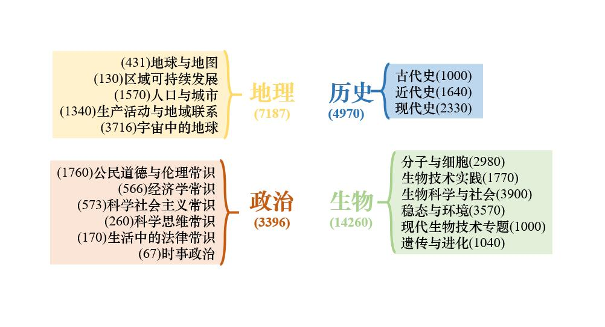
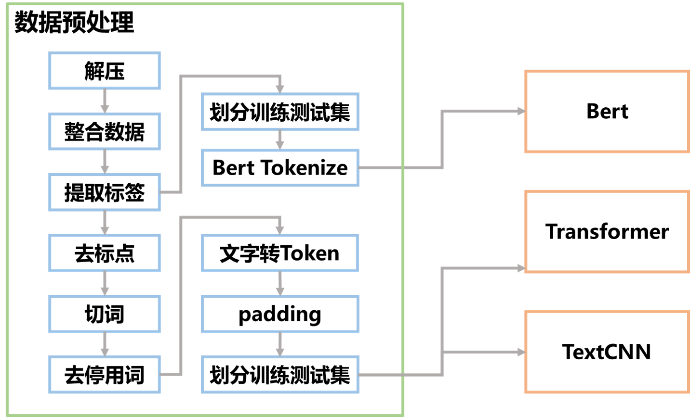
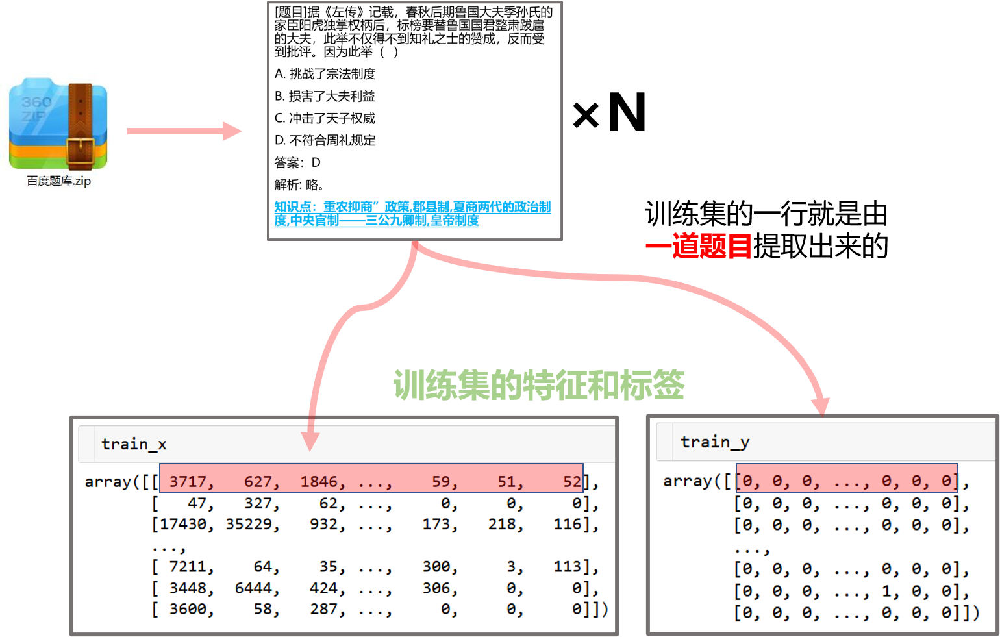

# Text-Classification

这个项目的任务是**试题知识点标注**。是一个多标签任务。数据集包含高中4个科目的题目，每门科目下又有不同的主题。如：**历史-古代史(1000)** 括号内的数字表示这个主题有1000道题目。总共有29000多道题目。

同时，每道题目有许多知识点，比如古代史的第一题是这样的：

**结尾部分**会有知识点，所以在数据预处理的时候还需要提取出知识点。项目的大致流程如下：

# 数据预处理

首先开局一个压缩包，~~代码全靠copy~~

先进行数据预处理，代码在`utils/preprocess.py`。数据预处理的详解可以看`notebook/数据预处理`。里边有非常详细的步骤。这里就不多提了。

经过数据预处理后得到了这三个模型能用的数据。对于**bert**是整理出：

- `train.tsv`
- `dev.tsv`
- `test.tsv`

对于**Transformer**和**TextCNN**是整理出

- `x.npy`
- `y.npy`

两者的区别是对于bert，此时的tsv文件中的文本还是字符，而且没有去停用词等操作。而对于Transformer和TextCNN数据预处理后的文件已经变成数字了。

# TextCNN

先来感性认识一下模型的输入：

在上一步textcnn预处理完成后，生成的训练集如下图。`train_x`是句子的token，`train_y`是标签。一行表示一道题目，句子和标签均是由一道题目提取出来的。

TextCNN模型我是基于一个keras的实现，参考着【[模型类方式编写线性回归](https://tf.wiki/zh/basic/models.html)】这个案例来写的。所以我的TextCNN模型比较类似于[谷歌Transformer](https://tensorflow.google.cn/tutorials/text/transformer?hl=en)的编写方式。

可以自定义kernel_size 大小各不相同的1维卷积层。主要对标上面这幅图，我实现的模型跟上面这张图类似。但是不是2分类模型而是多标签分类。

详细的TextCNN代码请看`notebook/textcnn`

# Transformer

对于使用tensorflow的用户来说，学transformer真的是非常方便，[官网教程](https://tensorflow.google.cn/tutorials/text/transformer)上直接有2.0的教程。